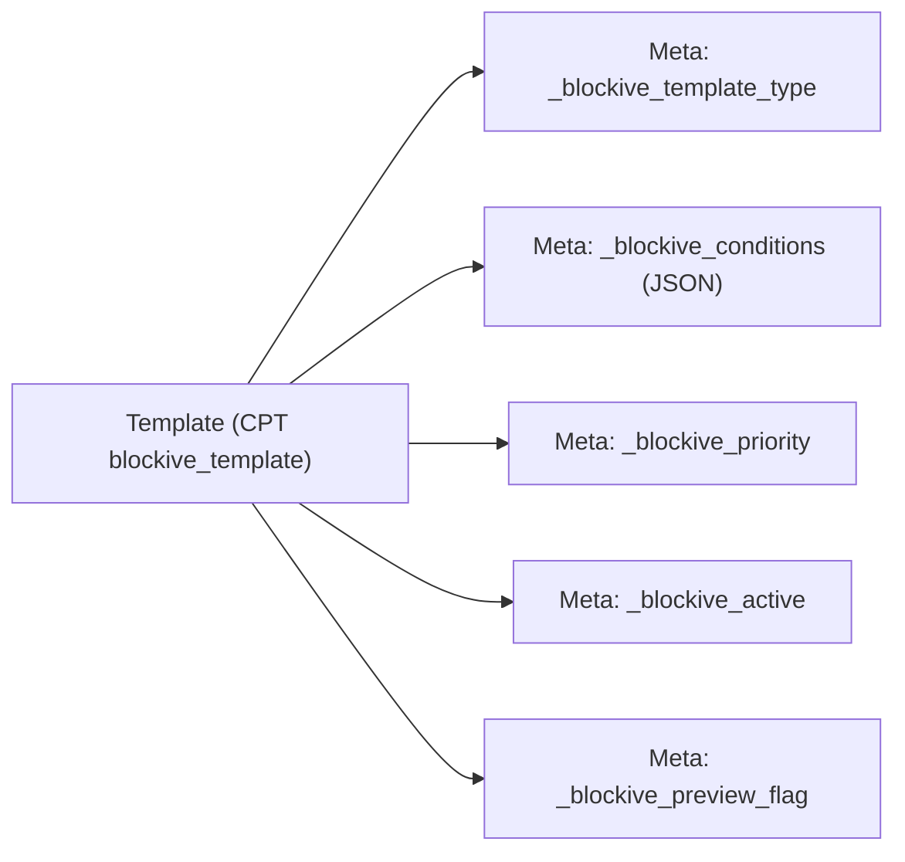
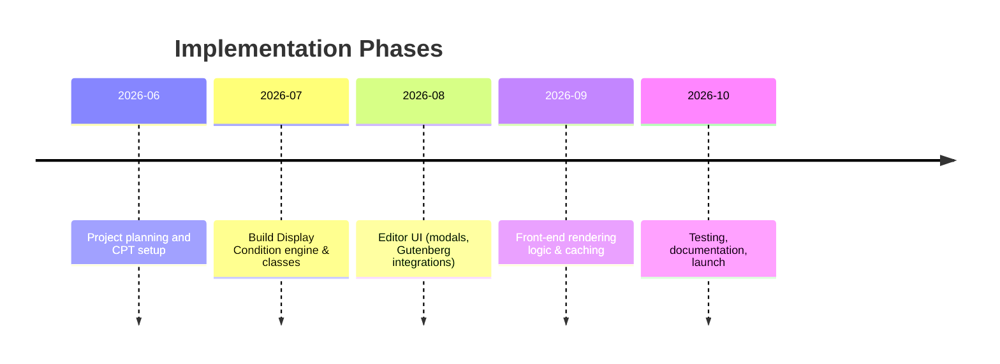

# Theme-Builder / Template Library Module for Blockive (Executive Summary)

We propose adding a **Theme Builder** module to the Blockive plugin by introducing a new CPT (`blockive_template`) that manages templates (e.g. headers, footers, single/archive templates, etc.) with user-defined **display conditions**. This avoids using `wp_block` and instead follows Elementor’s approach: templates stored as a custom post type with metadata for type, conditions, priority, etc. The UI flow is: **Add New Template** → modal to choose template type → Gutenberg editor for layout → “Save/Publish” → optional **Display Conditions** panel for include/exclude rules. On the front end, a **Template_Manager** will intercept theme hooks (via `template_include`, conditional tags, etc.) to select and render the appropriate template based on conditions.  

This document outlines the feature set, data model, API endpoints, editor integration, rendering logic, extensibility hooks, and security/performance considerations needed for implementation. (Implementation phases and data relationships are illustrated with Mermaid diagrams below.)

## 🔑 Feature Overview & UX Flows

- **Admin Menu & Template List**: New “Theme Builder” sub-menu under Blockive. List of existing templates with columns for *Type*, *Status* (active/inactive), *Priority*, *Conditions Summary*, and *Preview*. Each row has Edit/Delete actions.

- **Add New Template**:
  1. **User clicks “Add New Template”** (button/menu).  
  2. **Modal appears** (`wp.components.Modal`) listing template types (Header, Footer, Single, Archive, 404, etc.) as radio or select【34†L104-L110】.  
  3. **User selects a type and confirms**. Javascript captures choice and redirects to `post-new.php?post_type=blockive_template&template_type={TYPE}`.  
  4. **On post-new load**, hook (`load-post-new.php`) reads `$_GET['template_type']` and sets default post meta `_blockive_template_type` to the selected type, so the editor shows which type was chosen. 

- **Editing in Gutenberg**: Because `blockive_template` CPT is registered with `show_in_rest=true` and supports `editor`, the Gutenberg block editor will launch for the new template【16†L1-L4】. The editor toolbar can display the template type (as a label) and any custom sidebar panels.

- **Save/Publish**: After designing layout (using normal blocks), the user clicks *Save Draft* or *Publish*. We will add a **“Display Conditions”** button near the Publish controls using a Gutenberg slot-fill. For example, use `registerPlugin` with `<PluginDocumentSettingPanel>` or `<PluginPrePublishPanel>`【40†L579-L586】【43†L91-L100】 to inject a “Display Conditions” UI. When clicked, a React `<Modal>` opens for configuring conditions.

- **Display Conditions UI**:
  - The panel/modal allows defining **Include/Exclude rules** (similar to Elementor). Conditions have: a logical **relation** (`AND`/`OR` for groups), and a list of **condition entries** (e.g. *“Singular = Post”*, *“Category = News”*, *“User Role = Subscriber”*, etc.). Conditions can be nested.  
  - Conditions data is stored as JSON in a meta key `_blockive_conditions` (see Data Model below). Example structure (from Elementor): 
    ```json
    {
      "relation": "OR",
      "terms": [
        {"name": "is_front_page", "operator": "===", "value": true},
        {"relation": "AND", "terms": [
            {"name": "is_singular", "operator": "===", "value": "post"},
            {"name": "category", "operator": "in", "value": [12,14]}
          ]
        }
      ]
    }
    ```
    This matches “(Front Page) OR (Single post AND in categories 12 or 14)”【34†L104-L110】【42†L732-L740】. The UI can mirror this JSON schema (groups with relations, include/exclude toggles).

- **Preview Mode**: The user can click a *Preview* button to see the template. Implement via a query var (e.g. `?blockive-preview={ID}`) handled by `template_redirect`. Alternatively, a REST endpoint can return the rendered HTML (see REST section).

- **Acceptance Criteria**:
  - The **Add New** modal only appears on the Theme Builder screen and must require selecting a type before proceeding.  
  - The chosen template type meta is automatically set on creation and cannot be changed later (or can be changed by a custom dropdown in editor UI).  
  - The **Display Conditions** modal/panel should save meta `_blockive_conditions` to the CPT. Include basic presets (All Site, Logged In, etc.).  
  - Templates render exactly when conditions match current query. In case of multiple matches, the highest-priority active template is used (priority stored in meta).  
  - Existing theme templates (header.php, footer.php, single.php, etc.) should be overridden by these templates when active.  

## 🗃️ Data Model

- **Custom Post Type**: `blockive_template` (PHP constant e.g. `BLOCKIVE_TEMPLATE_CPT`). Registered with `public=>false`, `show_ui=>true`, `show_in_rest=>true` (enables Gutenberg) and supports `title`, `editor`, `revisions`. For example:
  ```php
  register_post_type('blockive_template', [
    'label' => 'Blockive Template',
    'public' => false, 'show_ui' => true, 'show_in_menu' => true,
    'show_in_rest' => true, 'supports' => ['title','editor','revisions'],
    'capability_type' => 'post',
  ]);
  ```
  (Requiring `show_in_rest => true` is mandatory to enable the block editor【16†L1-L4】.) 

- **Meta Keys**:
  - `_blockive_template_type` (string): e.g. `'header'`, `'footer'`, `'single'`, `'archive'`, `'404'`, `'page'`, etc. We recommend fixed values for each template category.  
  - `_blockive_conditions` (JSON): Stores the include/exclude rules structure (see schema below).  
  - `_blockive_priority` (int): Rendering priority; higher wins.  
  - `_blockive_active` (bool): Enable/disable a template without deleting.  
  - `_blockive_preview` (bool): Flag for preview mode (optional; can also pass via URL).

- **JSON Schema for Conditions**: 
  ```json
  {
    "relation": "AND|OR",            // Logical relation between rule groups
    "terms": [                      // Array of rules or nested groups
      {
        // If 'relation' exists, it's a sub-group; else a rule:
        "relation": "AND|OR",
        "terms": [ /* nested terms */ ]
      } or {
        "name": "...",              // Condition type/key (e.g. "post_type", "is_page", "taxonomy")
        "operator": "==",           // Operator (==, !=, in, not in, etc.)
        "value": ...                // Value or array (e.g. ["News", "Blog"])
      }
    ]
  }
  ```
  This matches Elementor’s advanced conditions structure【42†L732-L740】. Conditions can be nested arbitrarily.



- **Suggested Default Template Types**: Header, Footer, Archive (with subtypes like Blog, Category, Tag, Custom Taxonomy), Single (post, page, custom post type), 404, Search, (optionally) WooCommerce shop/single, etc. You may register these types via a filter `apply_filters('blockive/template_types', $types)` for extensibility.

- **RESTful Meta Exposure**: Use `register_post_meta('blockive_template', '_blockive_conditions', ['show_in_rest'=>true, 'type'=>'object']);` etc., so conditions and template_type are exposed in WP REST.

## 🔌 REST API Endpoints

Use the default REST handlers from `show_in_rest=true` for basic CRUD on templates, plus custom routes for preview/evaluation:

| Method | Endpoint                                 | Description                         | Required Capability        |
|--------|------------------------------------------|-------------------------------------|----------------------------|
| GET    | `/wp/v2/blockive_template`               | List all templates (supports rest filters like `?type=header`) | `edit_posts` (capability of CPT) |
| GET    | `/wp/v2/blockive_template/<id>`          | Get one template (includes content & meta) | `edit_post` or `read`        |
| POST   | `/wp/v2/blockive_template`               | Create new template                 | `edit_posts`                |
| PUT    | `/wp/v2/blockive_template/<id>`          | Update template (content, meta)     | `edit_post`                |
| DELETE | `/wp/v2/blockive_template/<id>`          | Delete a template                   | `delete_post`              |

Additionally, **custom REST routes** under a `blockive/v1` namespace for advanced operations:

| Method | Endpoint                            | Description                                | Capability        |
|--------|-------------------------------------|--------------------------------------------|-------------------|
| GET    | `/blockive/v1/templates/preview?id=<id>`   | Return rendered HTML of template #ID (for iframe preview) | `edit_post` or `read` |
| POST   | `/blockive/v1/conditions/evaluate`  | Submit current context (URL, user, etc.) and get matching template IDs/content | `read`           |
| GET    | `/blockive/v1/active-templates?context=<context>` | Get active templates for current WP query (to aid caching) | `read` |

For each endpoint, check current user capabilities and nonce. Use `register_rest_route()` in a class like `Blockive\Rest_Controller`. For preview, you might render via `template_include` with a custom flag; for evaluation you could simulate WP Conditional Tags or share logic with the rendering engine.

## 🛠️ Editor Integration (Gutenberg)

**Add New Template Modal** (Admin JS): On the Theme Builder admin page, hook the “Add New” button to open a React modal. Example snippet (using `wp.components`):
```js
const { Modal, Button, RadioControl } = wp.components;
const [open, setOpen] = useState(false);
const [type, setType] = useState('');
function openModal() { setOpen(true); }
function createTemplate() {
  // redirect to new post editor with type param
  window.location = `post-new.php?post_type=blockive_template&template_type=${type}`;
}
return (
  <>
    <Button isPrimary onClick={openModal}>Add New Template</Button>
    { open && (
      <Modal title="Add New Template" onRequestClose={() => setOpen(false)}>
        <RadioControl
          label="Template Type"
          selected={type}
          options={[
            { label: 'Header', value: 'header' },
            { label: 'Footer', value: 'footer' },
            { label: 'Single (Post)', value: 'single' },
            { label: 'Archive', value: 'archive' },
            { label: '404 Page', value: '404' },
            /* ...other types... */
          ]}
          onChange={val => setType(val)}
        />
        <Button isPrimary onClick={createTemplate}>Create Template</Button>
      </Modal>
    )}
  </>
);
```
Include this in an admin script enqueued on the Theme Builder page (`blockive_build.js`). 

**Redirect Handler (PHP)**: Hook into `load-post-new.php` for `blockive_template` to auto-set meta based on `template_type` query:
```php
add_action('load-post-new.php', function() {
    if ($_GET['post_type'] === 'blockive_template' && !empty($_GET['template_type'])) {
        add_filter('default_content', function($content) {
            // Optionally insert template hint shortcodes or instructions
            return $content;
        });
        add_action('save_post_blockive_template', function($post_id) {
            update_post_meta($post_id, '_blockive_template_type', sanitize_text_field($_GET['template_type']));
        }, 10, 1);
    }
});
```
This ensures the new template has its type meta.

**Publish/Save UI – Display Conditions Button**: Use Gutenberg Slot/Fills to add a button. For example, add a custom panel in the editor sidebar or below the publish button. Using `@wordpress/plugins`:
```js
import { registerPlugin } from '@wordpress/plugins';
import { PluginPrePublishPanel } from '@wordpress/editor'; // inject in pre-publish panel
import { Button } from '@wordpress/components';
const ConditionsPanel = () => (
  <PluginPrePublishPanel title="Display Conditions" initialOpen={false}>
    <Button isSecondary onClick={() => openConditionsModal()}>
      Edit Conditions
    </Button>
  </PluginPrePublishPanel>
);
registerPlugin('blockive-conditions-panel', { render: ConditionsPanel });
```
This uses `<PluginPrePublishPanel>` as per WP docs【45†L73-L82】. Alternatively, `<PluginDocumentSettingPanel>` can add a meta box in the sidebar【40†L579-L586】. The button’s handler (`openConditionsModal`) should open a React modal where conditions can be edited. 

**Saving Meta via `editPost`**: When conditions are updated in React, use the data API:
```js
wp.data.dispatch('core/editor').editPost({ meta: { _blockive_conditions: JSON.stringify(conditionsObj) } });
```
This saves the JSON string to post meta (assuming it’s registered with `show_in_rest`).

**Code Snippet: Gutenberg Slot-Fill Registration**:
```js
import { registerPlugin } from '@wordpress/plugins';
import { PluginPostStatusInfo } from '@wordpress/editor';
const BlockiveStatusPlugin = () => (
  <PluginPostStatusInfo>
    <Button isLink onClick={() => openConditionModal()}>
      Display Conditions...
    </Button>
  </PluginPostStatusInfo>
);
registerPlugin('blockive-display-conditions', { render: BlockiveStatusPlugin });
```
This example (from WordPress docs【43†L91-L100】) shows using `PluginPostStatusInfo` to insert into the document status area.

## ⚙️ Rendering Engine Design

Create a core `Template_Manager` class (e.g. `Blockive\Template_Manager`) responsible for selecting and rendering templates. Its tasks:

- **Query Active Templates**: On each page load, collect all published `blockive_template` posts of relevant types (e.g. header, footer, or matching the current condition context). Cache these in a static or transient for the request. Use hooks/filters like `blockive/get_templates` to allow altering the query args or the resulting template list.

- **Evaluate Conditions**: For each candidate template, parse its `_blockive_conditions` JSON. Implement a `Condition` class hierarchy (e.g. `Condition_Singular`, `Condition_Archive`, `Condition_User`, `Condition_Date`, `Condition_Taxonomy`, etc.), each with a `match()` method. For example, if a condition is `"rule":"post_type","value":"product"`, check `is_singular('product')`. For custom conditions, allow registration via a hook (`apply_filters('blockive/register_conditions')`) so addons can add rules.  

- **Algorithm**: Filter templates by include/exclude logic:
  1. For each template, iterate its condition groups. If an *Include* group is specified, ensure at least one term in that group matches the current query (respecting AND/OR). If an *Exclude* group has a matching term, disqualify the template.  
  2. Only templates where *all* include rules pass and *no* exclude rule triggers are considered active.  
  3. If multiple templates match (e.g. two headers both set to “All Pages”), pick the one with higher `_blockive_priority`. If tied, use the latest or a fallback.  

- **Rendering Hooks**: Use WordPress template filters:
  - `template_include`: At the top of `template_include`, check if `is_404()`, `is_single()`, `is_archive()`, etc., and if a custom template is active for this context. Return a PHP file or path that calls `blockive_render_template($template_id)`. For example:
    ```php
    add_filter('template_include', function($orig){
      if (is_404()) {
        $tpl = Blockive\Template_Manager::get_current_template('404');
        if ($tpl) return Blockive\Renderer::get_path('404.php'); // a wrapper that calls do_blocks()
      }
      // similar for is_singular, is_archive, etc.
      return $orig;
    });
    ```
  - For **Header/Footer injection**: Hook into theme actions. E.g. `do_action('blockive/before_header')` and `do_action('blockive/after_footer')` can be placed in a wrapper. Or simply replace `get_header()` logic by loading our header template: in `template_include`, if template_type='header', use that.
  - **Sidebar/Widget**: If building for block themes, you might render via `do_blocks()` the saved content. For classic themes, a wrapper PHP (like your own `header.php`) can call `echo do_blocks( $template->post_content )`.

- **Rendering Content**: When outputting the template, call `echo apply_filters('the_content', $post->post_content)` or `echo do_blocks( $post->post_content )` to render blocks properly. E.g.: 
  ```php
  function blockive_render_template($template_id) {
    $template = get_post($template_id);
    echo do_blocks( do_shortcode($template->post_content) );
  }
  ```
- **Caching**: To avoid querying and evaluating every request, cache results (transients or object cache). E.g. cache “active template for header” keyed by page ID or query vars for a short time. Clear cache when templates are saved/updated (hook `save_post_blockive_template` to delete relevant transients).

- **Preview Rendering**: Detect a URL like `?blockive-preview=123`. In `template_redirect`, if `$_GET['blockive-preview']` is set and user can edit that template, call `blockive_render_template()` directly and `exit`.

## 🔌 Hooks for Extensibility

Expose hooks/filters so other developers can extend behavior:

- **Registration/Setup**:
  - `do_action('blockive/register_template_types', &$types_array)`: Allow adding new template type identifiers (e.g. 'mega_menu').  
  - `do_action('blockive/register_conditions', $condition_manager_instance)`: Allow registering new condition handlers.  

- **Editor UI**:
  - `do_action('blockive/editor/enqueue_scripts')`: Let addons enqueue scripts/styles for the Blockive editor screen.  
  - Filters to customize the Add New modal (e.g. `blockive/template_type_labels`).  

- **Rendering/Query**:
  - `apply_filters('blockive/get_templates_query', $args, $context)`: Modify the WP_Query args used to fetch templates.  
  - `apply_filters('blockive/current_template', $template_id, $context)`: Alter which template ID is chosen for current context.  
  - `do_action('blockive/before_render_template', $template_id)`: Triggered before outputting a template.  
  - `do_action('blockive/after_render_template', $template_id)`: After output.  
  - `do_action('blockive/before_header')` and `do_action('blockive/after_footer')`: For hooking into theme parts.  

- **Condition Evaluation**:
  - `apply_filters('blockive/template_conditions', $conditions, $template_id)`: Filter conditions array before evaluating.  

Each hook should be well-documented in code so third-party plugins can integrate (e.g. adding WooCommerce conditions, new template locations, etc.).

## 🔒 Security & Performance

- **SQL and Escaping**: Do not construct raw SQL for conditions. If any custom queries are needed (e.g. if indexing condition relationships), use `$wpdb->prepare()`【33†L528-L532】. Always sanitize user input (`sanitize_text_field`, `intval`, `wp_json_encode` for JSON). Escape all output (use `esc_html`, `wp_kses_post`, etc.) in rendering templates.

- **Capabilities**: Only users with appropriate caps (`edit_posts`) should create/edit templates. Check `current_user_can('manage_options')` or similar on admin pages. Protect AJAX/REST with `rest_check_permissions_callback`.

- **Avoid `wp_block`**: As specified, do not reuse Gutenberg reusable blocks (`wp_block`). Use the separate CPT (`blockive_template`) to avoid confusion with core FSE templates.

- **Indexing Strategy**: Large-scale sites may have many templates or conditions. Consider storing conditions metadata in a format that can be indexed. E.g. separate meta for key fields (like post_type, taxonomy) for fast queries. Or use `register_meta()` with `WP object cache` or a dedicated table if needed. Avoid using SQL `LIKE '%<!-- wp:block {"ref":123}%'` searches (as done in Reusable Blocks Extended plugin), which scale poorly.

- **Caching**: Use WordPress transients or object cache for condition evaluation results. For example, cache the matched template ID for a given URL or query to avoid repeated computation.

- **Migration Note**: If upgrading from an older system (like reusable-blocks-based templates), provide a script to convert them into `blockive_template` posts (copy content and set meta accordingly). This should be a one-time migration script or upgrade routine.

- **Data Sanitization**: Before saving the conditions JSON, validate it against the expected schema. Use `wp_validate_utf8()`, `wp_strip_all_tags()` for text fields. Use `wp_kses_post()` when outputting block content.

## 📦 Deliverables & Phased Implementation

**Phase 1 – CPT & Basic UI (Q3 2026)**:
- `includes/post-types/class-blockive-template.php`: Registers CPT and sets up basic menu.
- Admin page “Theme Builder” listing templates.
- JavaScript for **Add New Template** modal in admin (`assets/js/admin-theme-builder.js`).
- Default meta keys and save handlers (`includes/class-template-manager.php` skeleton).

**Phase 2 – Conditions Engine (Q3–Q4 2026)**:
- `includes/conditions/` classes: `Condition_Singular`, `Condition_Archive`, `Condition_User`, etc., each with `match()` method.
- Template_Manager methods to evaluate conditions on page load.
- Caching logic (transients) in Template_Manager.

**Phase 3 – Editor Integration (Q4 2026)**:
- React components: `AddTemplateModal.js`, `ConditionsModal.js`, etc. Enqueue via `assets/js/blockive-editor.js`.
- Use Gutenberg slot-fills: code to add **Display Conditions** button (`PluginPrePublishPanel` / `PluginDocumentSettingPanel`)【40†L579-L586】【45†L73-L82】.
- Save conditions/meta via `core/editor` dispatch in JS.
- Unit tests for the React components (if in JS testing environment).

**Phase 4 – Rendering & Preview (Q4 2026)**:
- `includes/Renderer.php`: handles injection into `template_include` and outputs HTML via `do_blocks()`.
- Preview endpoint or `template_redirect` logic for `?blockive-preview`.
- Integration tests: ensure a header template appears on front end, 404 template works, etc.

**Phase 5 – Testing & Documentation (Late 2026)**:
- Write unit tests for Condition classes, Template_Manager logic.  
- Integration tests (WP_Test): e.g. create templates programmatically, simulate requests, assert correct template content.  
- Acceptance tests (could be Behat or simple scenario docs): “Given a header template set to include All, then any page should use that header”.  
- End-to-end tests (optional): maybe use WP-browser to automate Gutenberg flows.



## 📑 Supplementary Tables

**Template Types**:

| Type       | Description                   | WP Condition Check (example)    |
|------------|-------------------------------|---------------------------------|
| Header     | Site header                   | Render on get_header (all pages) |
| Footer     | Site footer                   | Render on wp_footer (all pages) |
| Single     | Single post/page template     | `is_singular()` or `template_include` for single|
| Archive    | Archive template (blog, etc.) | `is_archive()`, `is_home()`, `is_category()`, `template_include` |
| 404        | Not found page                | `is_404()` (via `template_include`) |
| Page       | Static pages                  | `is_page()` or via `template_include` |
| [Custom]   | E.g. WooCommerce, etc.        | Plugin can extend (e.g. `is_shop()`)|

**Condition Categories**:

| Category       | Rule Examples                                  |
|----------------|-----------------------------------------------|
| General        | Entire Site (no condition), Front Page, Blog Home |
| User           | User logged in/out, Role equals X             |
| Date/Time      | Specific date, day of week, time of day       |
| Singular       | Post Type equals X, Specific Post IDs         |
| Archive        | Taxonomy (Category, Tag) equals Y, Author archives |
| Page Types     | Page template equals X (if needed)            |
| WooCommerce    | Shop, Product Category, Product Tag, etc. (add via filters) |

**REST Routes** (besides WP core CPT endpoints):

| Method | Route                          | Description                    |
|--------|--------------------------------|--------------------------------|
| GET    | `/blockive/v1/templates/preview?id=<id>` | Render a template by ID (used for iframe preview). |
| POST   | `/blockive/v1/conditions/evaluate`  | Accept current query params, return matching template IDs/content. |
| GET    | `/blockive/v1/active-templates`     | Return active templates for current query context. |  

*(All custom routes should check capabilities: e.g. edit or read permissions.)*

## 🔍 Prioritized Source Insights

- **Elementor Theme Builder**: Templates are stored as a CPT (`elementor_library`) with conditions. Users select multiple include/exclude conditions (e.g. “Include: All Singluar Posts; Exclude: Category=News”)【34†L104-L110】. Elementor’s JSON structure uses `"relation": "or"` or `"and"` with nested terms【42†L732-L740】. We mimic this flexible schema.
- **WordPress REST & Gutenberg**: The WordPress Developer Handbook confirms that `show_in_rest=true` is required to use Gutenberg on a CPT【16†L1-L4】【20†L1166-L1174】. The SlotFills reference shows how to use `registerPlugin` with `<PluginPostStatusInfo>`, `<PluginPrePublishPanel>`, or `<PluginDocumentSettingPanel>` for inserting UI【43†L91-L100】【45†L73-L82】. We’ll use these slot-fills to add our “Display Conditions” interface.
- **Blockive Existing Code**: (Assuming existing Blockive code has no theme builder.) We ensure no conflicts with current block-based addon functions.

## 🚀 Conclusion

The proposed Theme Builder for Blockive provides a powerful, Elementor-like system for managing templates entirely within the plugin. By following WordPress best practices (custom post types, REST API, Gutenberg slot-fills) and learning from Elementor’s display condition design【34†L104-L110】【42†L732-L740】, we ensure a robust implementation. The deliverables listed above (PHP classes, REST controllers, React components, tests) will give an implementation team a clear roadmap. External developers can hook into it via our provided actions and filters, and core engine classes (Template_Manager, Condition classes) will handle the heavy lifting. 

By phasing development and writing unit/integration tests, we can roll out a high-quality Theme Builder feature in Blockive. Security (using `$wpdb->prepare()`【33†L528-L532】, capability checks) and performance (caching, indexing) considerations are explicitly addressed, ensuring scalability.  

